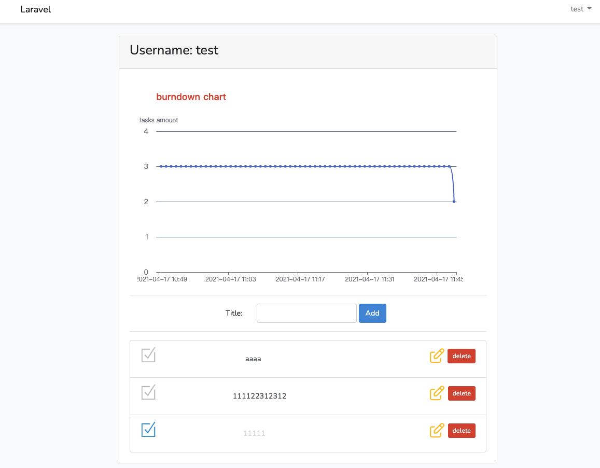

# TodoList

This is a Web Application created by Vue.js and Laravel for interview coding test.

install

1. git clone `https://github.com/TOMMYWHY/todolist.git`
2. `cd todolist` and run  `composer install` 
3. create and setup `.env`
4. Migrate the migrations: `php artisan migrate`
5. Generate application encryption key: `php artisan key:generate`
6. run `npm install` and `npm run dev` to install node.js dependencies

------------ | -------------

